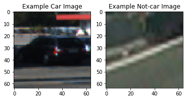
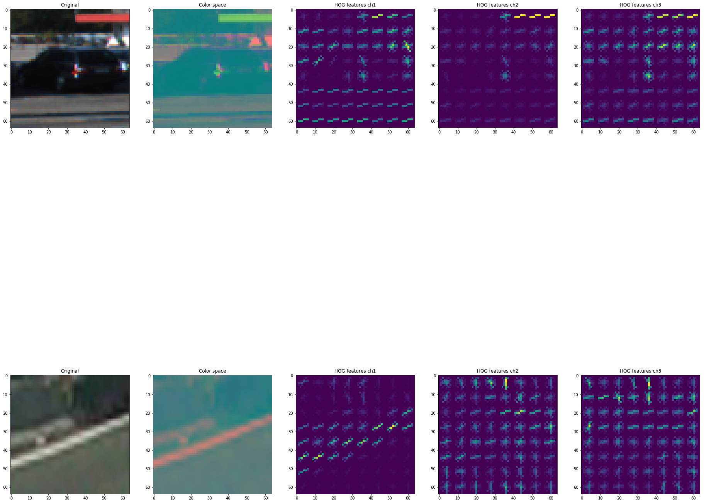
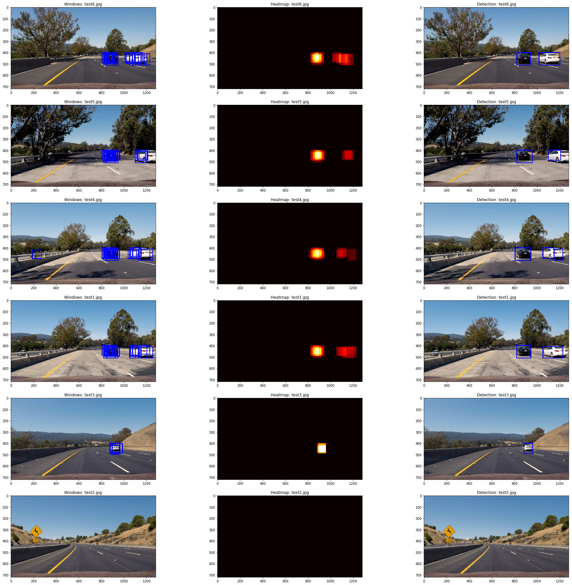

# Vehicle Detection and Tracking

The goals / steps of this project are the following:

1. Import the images used for the classifier.
2. Used functions. Perform a Histogram of Oriented Gradients (HOG) feature extraction on a labeled training set of images 
3. Train a classifier Linear SVM classifier
4. Implement a sliding-window technique and use your trained classifier to search for vehicles in images.
5. Run your pipeline on a video stream (start with the test_video.mp4 and later implement on full project_video.mp4) and create a heat map of recurring detections frame by frame to reject outliers and follow detected vehicles.
6. Estimate a bounding box for vehicles detected.

In this writeup document, the chapters are the goals with the same numbering as noted above. The code is also included and the images are direct output of the code.

*Most of the code is based on the code from the lessons. I've also visited the forum to get some great ideas of fellow students.*

## 0. Imports

Imports of all used libraries.


```python
import matplotlib.image as mpimg
import matplotlib.pyplot as plt
import numpy as np
import cv2
import glob
import time
import collections

from sklearn.svm import LinearSVC
from sklearn import tree
from sklearn.preprocessing import StandardScaler
from skimage.feature import hog
from sklearn.model_selection import train_test_split
from scipy.ndimage.measurements import label

from moviepy.editor import VideoFileClip
from IPython.display import HTML
```

## 1. Import images

In this section all images used for classification are imported. They are shuffled and some information about the dataset is given. Example images are given from both sets.


```python
%matplotlib inline

# Load the car image file-names
car_images = glob.glob('data/vehicles/GTI_Far/*.png')
car_images.extend(glob.glob('data/vehicles/GTI_Left/*.png'))
car_images.extend(glob.glob('data/vehicles/GTI_MiddleClose/*.png'))
car_images.extend(glob.glob('data/vehicles/GTI_Right/*.png'))
car_images.extend(glob.glob('data/vehicles/KITTI_extracted/*.png'))

# Load the non-car image file-names
non_car_images = glob.glob('data/non-vehicles/GTI/*.png')
non_car_images.extend(glob.glob('data/non-vehicles/extras/*.png'))

# Shuffle the array
np.random.shuffle(car_images)
np.random.shuffle(non_car_images)

# Define a function to return some characteristics of the dataset 
def data_look(car_list, notcar_list):
    data_dict = {}
    # Define a key in data_dict "n_cars" and store the number of car images
    data_dict["n_cars"] = len(car_list)
    # Define a key "n_notcars" and store the number of notcar images
    data_dict["n_notcars"] = len(notcar_list)
    # Read in a test image, either car or notcar
    example_img = mpimg.imread(car_list[0])
    # Define a key "image_shape" and store the test image shape 3-tuple
    data_dict["image_shape"] = example_img.shape
    # Define a key "data_type" and store the data type of the test image.
    data_dict["data_type"] = example_img.dtype
    # Return data_dict
    print('There are', data_dict["n_cars"], ' cars and', data_dict["n_notcars"], ' non-cars')
    print('of size: ',data_dict["image_shape"], ' and data type:', data_dict["data_type"])
    
data_look(car_images, non_car_images)

# Just for fun choose random car / not-car indices and plot example images   
car_ind = np.random.randint(0, len(car_images))
notcar_ind = np.random.randint(0, len(non_car_images))
    
# Read in car / not-car images
car_image = mpimg.imread(car_images[car_ind])
notcar_image = mpimg.imread(non_car_images[notcar_ind])


# Plot the examples
fig = plt.figure()
plt.subplot(121)
plt.imshow(car_image)
plt.title('Example Car Image')
plt.subplot(122)
plt.imshow(notcar_image)
plt.title('Example Not-car Image')
```

    There are 8792  cars and 8968  non-cars
    of size:  (64, 64, 3)  and data type: float32


    <matplotlib.text.Text at 0x7f6c8eb327b8>





## 2. Functions

In this section you can find all functions I used. Explaination of each function is in the code itself.


```python
# Define a function to return HOG features and visualization
def get_hog_features(img, orient, pix_per_cell, cell_per_block, 
                        vis=False, feature_vec=True):
    # Call with two outputs if vis==True
    if vis == True:
        # Get the hog features using the hog function of sklearn.features packages
        features, hog_image = hog(img, orientations=orient, 
                                  pixels_per_cell=(pix_per_cell, pix_per_cell),
                                  cells_per_block=(cell_per_block, cell_per_block), 
                                  transform_sqrt=False, 
                                  visualise=vis, feature_vector=feature_vec)
        return features, hog_image
    # Otherwise call with one output
    else:      
        # Get the hog features using the hog function of sklearn.features packages
        features = hog(img, orientations=orient, 
                       pixels_per_cell=(pix_per_cell, pix_per_cell),
                       cells_per_block=(cell_per_block, cell_per_block), 
                       transform_sqrt=False, 
                       visualise=vis, feature_vector=feature_vec)
        return features

# Define a function to compute binned color features  
def bin_spatial(img, size=(32, 32)):
    # Use cv2.resize().ravel() to create the feature vector
    features = cv2.resize(img, size).ravel() 
    # Return the feature vector
    return features

# Define a function to compute color histogram features 
def color_hist(img, nbins=32, bins_range=(0, 256)):
    # Compute the histogram of the color channels separately
    channel1_hist = np.histogram(img[:,:,0], bins=nbins, range=bins_range)
    channel2_hist = np.histogram(img[:,:,1], bins=nbins, range=bins_range)
    channel3_hist = np.histogram(img[:,:,2], bins=nbins, range=bins_range)
    # Concatenate the histograms into a single feature vector
    hist_features = np.concatenate((channel1_hist[0], channel2_hist[0], channel3_hist[0]))
    # Return the individual histograms, bin_centers and feature vector
    return hist_features

# Define a function to extract features from a list of images
# Have this function call bin_spatial() and color_hist()
def extract_features(imgs, color_space='RGB', spatial_size=(32, 32),
                        hist_bins=32, orient=9, 
                        pix_per_cell=8, cell_per_block=2, hog_channel=0,
                        spatial_feat=True, hist_feat=True, hog_feat=True):
    # Create a list to append feature vectors to
    features = []
    # Iterate through the list of images
    for file in imgs:
        file_features = []
        # Read in each one by one
        image = mpimg.imread(file)
        # apply color conversion if other than 'RGB'
        if color_space != 'RGB':
            if color_space == 'HSV':
                feature_image = cv2.cvtColor(image, cv2.COLOR_RGB2HSV)
            elif color_space == 'LUV':
                feature_image = cv2.cvtColor(image, cv2.COLOR_RGB2LUV)
            elif color_space == 'HLS':
                feature_image = cv2.cvtColor(image, cv2.COLOR_RGB2HLS)
            elif color_space == 'YUV':
                feature_image = cv2.cvtColor(image, cv2.COLOR_RGB2YUV)
            elif color_space == 'YCrCb':
                feature_image = cv2.cvtColor(image, cv2.COLOR_RGB2YCrCb)
        else: feature_image = np.copy(image)      

        # Get spatial features using the `bin_spatial` function
        if spatial_feat == True:
            spatial_features = bin_spatial(feature_image, size=spatial_size)
            file_features.append(spatial_features)
        # Get color features using the `color_hist` function
        if hist_feat == True:
            # Apply color_hist()
            hist_features = color_hist(feature_image, nbins=hist_bins)
            file_features.append(hist_features)
        if hog_feat == True:
        # Call get_hog_features() with vis=False, feature_vec=True
            if hog_channel == 'ALL':
                hog_features = []
                # For all channels, append the features to the array
                for channel in range(feature_image.shape[2]):
                    hog_features.append(get_hog_features(feature_image[:,:,channel], 
                                        orient, pix_per_cell, cell_per_block, 
                                        vis=False, feature_vec=True))
                # Flatten the array
                hog_features = np.ravel(hog_features)        
            else:
                # Get the hog features for one channel
                hog_features = get_hog_features(feature_image[:,:,hog_channel], orient, 
                            pix_per_cell, cell_per_block, vis=False, feature_vec=True)
            # Append the new feature vector to the features list
            file_features.append(hog_features)
        features.append(np.concatenate(file_features))
    # Return list of feature vectors
    return features
    

# Define a function to draw bounding boxes
def draw_boxes(img, bboxes, color=(0, 0, 255), thick=6):
    # Make a copy of the image
    imcopy = np.copy(img)
    # Iterate through the bounding boxes
    for bbox in bboxes:
        # Draw a rectangle given bbox coordinates
        cv2.rectangle(imcopy, bbox[0], bbox[1], color, thick)
    # Return the image copy with boxes drawn
    return imcopy

# Convert color function for a given RGB-image, to convert it to a given 'conv'
def convert_color(img, conv='RGB2YCrCb'):
    if conv == 'RGB2YCrCb':
        return cv2.cvtColor(img, cv2.COLOR_RGB2YCrCb)
    if conv == 'RGB2LUV':
        return cv2.cvtColor(img, cv2.COLOR_RGB2LUV)
    if conv == 'RGB2HSV':
        return cv2.cvtColor(img, cv2.COLOR_RGB2HSV)
    if conv == 'RGB2YUV':
        return cv2.cvtColor(img, cv2.COLOR_RGB2HSV)

# Add heat function to add the head for a list of bounding boxes
def add_heat(heatmap, bbox_list):
    # Iterate through list of bboxes
    for box in bbox_list:
        # Add += 1 for all pixels inside each bbox
        # Assuming each "box" takes the form ((x1, y1), (x2, y2))
        heatmap[box[0][1]:box[1][1], box[0][0]:box[1][0]] += 1

    # Return updated heatmap
    return heatmap# Iterate through list of bboxes
    
# Apply threshold function for heatmap where the heat is higher than a threshold to remove outliers.
def apply_threshold(heatmap, threshold):
    # Zero out pixels below the threshold
    heatmap[heatmap <= threshold] = 0
    # Return thresholded map
    return heatmap

# Draw bounding boxes using labels gotten from heatmap
def draw_labeled_bboxes(img, labels):
    # Iterate through all detected cars
    for car_number in range(1, labels[1]+1):
        # Find pixels with each car_number label value
        nonzero = (labels[0] == car_number).nonzero()
        # Identify x and y values of those pixels
        nonzeroy = np.array(nonzero[0])
        nonzerox = np.array(nonzero[1])
        # Define a bounding box based on min/max x and y
        bbox = ((np.min(nonzerox), np.min(nonzeroy)), (np.max(nonzerox), np.max(nonzeroy)))
        # Draw the box on the image
        cv2.rectangle(img, bbox[0], bbox[1], (0,0,255), 6)
    # Return the image
    return img

# The heatmap function to convert a given image with boxes to a heatmap using the functions above
def find_heat(image, box_list, threshold = 1):
    heat = np.zeros_like(image[:,:,0]).astype(np.float)

    # Add heat to each box in box list
    heat = add_heat(heat, box_list)

    # Apply threshold to help remove false positives
    heat = apply_threshold(heat, threshold)

    # Visualize the heatmap when displaying    
    heatmap = np.clip(heat, 0, 255)
    
    return heatmap
```

## 3. Classifier

In this function the classifier is created, based on a lot of import variables. The explaination of the used variables can be found some cells below.

A linear SVC is used as classifier, where I also tried to use a Desicion Tree. Because I couldn't get the parameters in the DT correct to run fast enough on my computer with a good accuracy, I used the SVC. 

To prevent the classifier of giving `NaN` errors, I've added `np.nan_to_num` functions for both (car and non-car) feature arrays.


```python
def create_classifier(car_images, non_car_images, color_space, spatial_size, hist_bins, orient, pix_per_cell, cell_per_block, clf = False):
    car_features = extract_features(car_images, color_space=color_space, 
                            spatial_size=spatial_size, hist_bins=hist_bins, 
                            orient=orient, pix_per_cell=pix_per_cell, 
                            cell_per_block=cell_per_block, 
                            hog_channel=hog_channel, spatial_feat=spatial_feat, 
                            hist_feat=hist_feat, hog_feat=hog_feat)
    notcar_features = extract_features(non_car_images, color_space=color_space, 
                            spatial_size=spatial_size, hist_bins=hist_bins, 
                            orient=orient, pix_per_cell=pix_per_cell, 
                            cell_per_block=cell_per_block, 
                            hog_channel=hog_channel, spatial_feat=spatial_feat, 
                            hist_feat=hist_feat, hog_feat=hog_feat)

    car_features = np.nan_to_num(car_features)
    notcar_features = np.nan_to_num(notcar_features)
    
    X = np.vstack((car_features, notcar_features)).astype(np.float64)  
    
    # Fit a per-column scaler
    X_scaler = StandardScaler().fit(X)
    
    # Apply the scaler to X
    scaled_X = X_scaler.transform(X)

    # Define the labels vector
    y = np.hstack((np.ones(len(car_features)), np.zeros(len(notcar_features))))


    # Split up data into randomized training and test sets
    rand_state = np.random.randint(0, 100)
    X_train, X_test, y_train, y_test = train_test_split(
        scaled_X, y, test_size=0.2, random_state=rand_state)

    print('Using:',orient,'orientations',pix_per_cell,
        'pixels per cell and', cell_per_block,'cells per block')
    print('Feature vector length:', len(X_train[0]))
    
    if clf == False:
        # Use a linear SVC 
        clf = LinearSVC()
        
    # Check the training time for the SVC
    t=time.time()
    clf.fit(X_train, y_train)
    t2 = time.time()
    print(round(t2-t, 2), 'Seconds to train SVC...')
    # Check the score of the CLF
    print('Test Accuracy of CLF = ', round(clf.score(X_test, y_test), 4))
    # Check the prediction time for a single sample
    t=time.time()
    
    return X_scaler, clf

```

## 4. Sliding window

The sliding window technique is used to find cars in a certain frame. I've modified the function given by the lessons in some parts:
- I added the x-start and x-stop parameters to also control the X of the frame to have a faster performance. In the final video I've used the full width of each frame.
- I added a confidence level, but with the final classifier and using heatmaps this one was not needed anymore.
- I do not return an image anymore, just the bounding boxes are returned.


```python
# Define a single function that can extract features using hog sub-sampling and make predictions
def find_cars(img, xstart, xstop, ystart, ystop, scale, clf, X_scaler, orient, pix_per_cell, cell_per_block, spatial_size, hist_bins, color_conv):
    window = 64
    # Instead of overlap, define how many cells to step
    cells_per_step = 2
    
    img = img.astype(np.float32)/255
    
    img_tosearch = img[ystart:ystop,xstart:xstop,:]
    ctrans_tosearch = convert_color(img_tosearch, conv=color_conv)
    if scale != 1:
        imshape = ctrans_tosearch.shape
        ctrans_tosearch = cv2.resize(ctrans_tosearch, (np.int(imshape[1]/scale), np.int(imshape[0]/scale)))
        
    ch1 = ctrans_tosearch[:,:,0]
    ch2 = ctrans_tosearch[:,:,1]
    ch3 = ctrans_tosearch[:,:,2]

    # Define blocks and steps as above
    nxblocks = (ch1.shape[1] // pix_per_cell) - cell_per_block + 1
    nyblocks = (ch1.shape[0] // pix_per_cell) - cell_per_block + 1 
    nfeat_per_block = orient*cell_per_block**2
    
    # 64 was the orginal sampling rate, with 8 cells and 8 pix per cell
    nblocks_per_window = (window // pix_per_cell) - cell_per_block + 1
    nxsteps = (nxblocks - nblocks_per_window) // cells_per_step
    nysteps = (nyblocks - nblocks_per_window) // cells_per_step
    
    # Compute individual channel HOG features for the entire image
    hog1 = get_hog_features(ch1, orient, pix_per_cell, cell_per_block, feature_vec=False)
    hog2 = get_hog_features(ch2, orient, pix_per_cell, cell_per_block, feature_vec=False)
    hog3 = get_hog_features(ch3, orient, pix_per_cell, cell_per_block, feature_vec=False)
    
    bboxes = []
    
    for xb in range(nxsteps):
        for yb in range(nysteps):
            ypos = yb*cells_per_step
            xpos = xb*cells_per_step
            # Extract HOG for this patch
            hog_feat1 = hog1[ypos:ypos+nblocks_per_window, xpos:xpos+nblocks_per_window].ravel() 
            hog_feat2 = hog2[ypos:ypos+nblocks_per_window, xpos:xpos+nblocks_per_window].ravel() 
            hog_feat3 = hog3[ypos:ypos+nblocks_per_window, xpos:xpos+nblocks_per_window].ravel() 
            hog_features = np.hstack((hog_feat1, hog_feat2, hog_feat3))

            xleft = xpos*pix_per_cell
            ytop = ypos*pix_per_cell

            # Extract the image patch
            subimg = cv2.resize(ctrans_tosearch[ytop:ytop+window, xleft:xleft+window], (64,64))
          
            # Get color features
            spatial_features = bin_spatial(subimg, size=spatial_size)
            hist_features = color_hist(subimg, nbins=hist_bins)

            # Scale features and make a prediction
            test_features = X_scaler.transform(np.hstack((spatial_features, hist_features, hog_features)).reshape(1, -1))    
            #test_features = X_scaler.transform(np.hstack((shape_feat, hist_feat)).reshape(1, -1))    
            test_prediction = clf.predict(test_features)
            conf = clf.decision_function(test_features)
            if test_prediction == 1: # and conf > 1:
                xbox_left = np.int(xleft*scale)+xstart
                ytop_draw = np.int(ytop*scale)
                win_draw = np.int(window*scale)
                bboxes.append([(xbox_left, ytop_draw+ystart),(xbox_left+win_draw,ytop_draw+win_draw+ystart)])
                
    return bboxes
```

### Final parameters

I've had difficulties with finding the right parameters, but when changing to YCrCb space it was easy to recognize the cars clearly.

- color_space: I've tried HSV, LUV and YCrCb. With both HSV and LUV color spaces I had a lot of false positives at the horizon. YCrCb gave me the best results.
- color_conv: The parameter to convert the image to the right color channel to make it easier to edit.
- orient: 9 HOG orientaties were enough for me
- pix_per_cell: 8 pixels per cell gave me good results
- cell_per_block: I've used 2 cells per HOG block
- hog_channel: I used all HOG channels
- spatial_size: I tried 16x16 and 32x32, and in my case the latter was better.
- hist_bins: 32 bins gave me the best results
- spatial_feat: On for more features
- hist_feat: On for more features
- hog_feat: On for more features


```python
color_space = 'YCrCb' # Can be RGB, HSV, LUV, HLS, YUV, YCrCb
color_conv = 'RGB2YCrCb' # Can be RGB2YCrCb, BGR2YCrCb, RGB2LUV, RGB2HSV, RGB2YUV
orient = 9  # HOG orientations
pix_per_cell = 8 # HOG pixels per cell
cell_per_block = 2 # HOG cells per block
hog_channel = "ALL" # Can be 0, 1, 2, or "ALL"
spatial_size = (32, 32) # Spatial binning dimensions
hist_bins = 32  # Number of histogram bins
spatial_feat = True # Spatial features on or off
hist_feat = True # Histogram features on or off
hog_feat = True # HOG features on or off
```

### Classifier configuration

I've used 2000 car images and 2000 non-car images to get even classification groups. Also the set parameters above are here given to the `create_classifier` function. With these parameters the Accuracy of the SVC was `0.9862`, which was enough. Although the accuracy did not give me the most information, just drawing the bounding boxes on images gave me more insights about how good the trained model was.


```python
# init_clf = tree.DecisionTreeClassifier(min_samples_split=10)
X_scaler, clf = create_classifier(car_images[0:2000], non_car_images[0:2000], color_space, \
                                  spatial_size, hist_bins, orient, pix_per_cell, cell_per_block, False)
```

    Using: 9 orientations 8 pixels per cell and 2 cells per block
    Feature vector length: 8460
    1.14 Seconds to train SVC...
    Test Accuracy of CLF =  0.9862


## 5. Pipeline

In here I've created the pipeline using the `SearchVariables` class. In this class you are able to give the window-search variables. I've used multiple search windows with different scales for finding the cars on different y-values because of the perpective in the image.

The pipeline itself consists of the following steps:
- Define search window
- Find the cars (and boundingboxes) for every search window
- Get the heatmap for these boxes
- Build up a queue for the video, so previous frames are also used for the heatmap
- Draw the boxes for where the heatmap is higher than the given threshold.

I've played around with the threshold, even using the length of the history-queue, but just setting the threshold to 1 gave me the best results.


```python
class SearchVariables:
    def __init__(self, xstart, xstop, ystart, ystop, scale):
        self.xstart = xstart
        self.xstop = xstop
        self.ystart = ystart
        self.ystop = ystop
        self.scale = scale

def process_image(image, heatmap_queue=False):
    search_locations = [  
        SearchVariables(0, 1280, 400, 520, 1.0),
        SearchVariables(0, 1280, 400, 520, 1.2),
        SearchVariables(0, 1280, 400, 530, 1.4),
        SearchVariables(0, 1280, 410, 540, 1.6),
        SearchVariables(0, 1280, 410, 560, 2.0),
        SearchVariables(0, 1280, 410, 570, 2.2),
        SearchVariables(0, 1280, 420, 580, 2.4),
        SearchVariables(0, 1280, 420, 590, 2.6),
        SearchVariables(0, 1280, 420, 600, 2.8),   
        SearchVariables(0, 1280, 430, 610, 3.0),   
    ]
    
    all_bboxes = []
    for search_location in search_locations:
        bboxes = find_cars(image, search_location.xstart, search_location.xstop, \
                           search_location.ystart, search_location.ystop, \
                           search_location.scale, clf, X_scaler, orient, pix_per_cell, \
                           cell_per_block, spatial_size, hist_bins, color_conv)
        all_bboxes.extend(bboxes)
    
    windows = draw_boxes(image, all_bboxes)
    
    threshold = 1
    
    heatmap = find_heat(image, all_bboxes, threshold)
   
    current_heatmap = np.copy(heatmap)
    if heatmap_queue != False:
        heatmap = sum(heatmap_queue)
        
    # Find final boxes from heatmap using label function
    labels_heat = label(heatmap)
    
    detected_cars = draw_labeled_bboxes(image, labels_heat)
    
    return detected_cars, windows, current_heatmap, heatmap
```

### Using HOG functions on test images

Here are some examples of images for what HOG is doing using this color space and feature extraction.


```python
car_color = convert_color(car_image, conv=color_conv)
notcar_color = convert_color(notcar_image, conv=color_conv)

car_ch1 = car_color[:,:,0]
car_ch2 = car_color[:,:,1]
car_ch3 = car_color[:,:,2]

x, car_features_1 = get_hog_features(car_ch1, orient, pix_per_cell, cell_per_block, vis=True, feature_vec=True)
x, car_features_2 = get_hog_features(car_ch2, orient, pix_per_cell, cell_per_block, vis=True, feature_vec=True)
x, car_features_3 = get_hog_features(car_ch3, orient, pix_per_cell, cell_per_block, vis=True, feature_vec=True)

notcar_ch1 = notcar_color[:,:,0]
notcar_ch2 = notcar_color[:,:,1]
notcar_ch3 = notcar_color[:,:,2]

x, notcar_features_1 = get_hog_features(notcar_ch1, orient, pix_per_cell, cell_per_block, vis=True, feature_vec=True)
x, notcar_features_2 = get_hog_features(notcar_ch2, orient, pix_per_cell, cell_per_block, vis=True, feature_vec=True)
x, notcar_features_3 = get_hog_features(notcar_ch3, orient, pix_per_cell, cell_per_block, vis=True, feature_vec=True)

f, axarr = plt.subplots(2, 5, figsize=(32,32))

axarr[0,0].set_title('Original')
axarr[0,0].imshow(car_image)
axarr[0,1].set_title('Color space')
axarr[0,1].imshow(car_color)
axarr[0,2].set_title('HOG features ch1')
axarr[0,2].imshow(car_features_1)
axarr[0,3].set_title('HOG features ch2')
axarr[0,3].imshow(car_features_2)
axarr[0,4].set_title('HOG features ch3')
axarr[0,4].imshow(car_features_3)

axarr[1,0].set_title('Original')
axarr[1,0].imshow(notcar_image)
axarr[1,1].set_title('Color space')
axarr[1,1].imshow(notcar_color)
axarr[1,2].set_title('HOG features ch1')
axarr[1,2].imshow(notcar_features_1)
axarr[1,3].set_title('HOG features ch2')
axarr[1,3].imshow(notcar_features_2)
axarr[1,4].set_title('HOG features ch3')
axarr[1,4].imshow(notcar_features_3)
```


    <matplotlib.image.AxesImage at 0x7f6c8bf811d0>





### Using pipeline for images

Using the pipeline for the test-images, showing the detected windows, heatmap, and the final car-detection.


```python
test_images = glob.glob('test_images/*.jpg')

f, axarr = plt.subplots(len(test_images), 3, figsize=(32,32))

for i, test_fname in enumerate(test_images):
    test_image = mpimg.imread(test_fname)
    
    fname_only = test_fname.split('/')[1]
    
    detected_cars, windows, current_heatmap, total_heatmap = process_image(test_image)
    
    axarr[i,0].set_title('Windows: ' + fname_only)
    axarr[i,0].imshow(windows)
    axarr[i,1].set_title('Heatmap: ' + fname_only)
    axarr[i,1].imshow(current_heatmap, cmap='hot')
    axarr[i,2].set_title('Detection: ' + fname_only)
    axarr[i,2].imshow(detected_cars)

    mpimg.imsave('output_images/'+fname_only, detected_cars)

```





### Using pipeline for video

Using the pipeline for the video, first the `test_video.mp4` and later the `project_video.mp4`. The exported video's can be found in the `output_images` folder.


```python
# Rewrite image to frame processing
def process_frame(image):
    detected_cars, windows, current_heatmap, total_heatmap = process_image(image, heatmap_queue)
    heatmap_queue.append(current_heatmap)
    return detected_cars
```


```python
heatmap_queue = collections.deque(maxlen=12)

output = 'output_images/test_video.mp4'
clip = VideoFileClip("test_video.mp4")
project_clip = clip.fl_image(process_frame)
%time project_clip.write_videofile(output, audio=False)
```

    [MoviePy] >>>> Building video output_images/test_video.mp4
    [MoviePy] Writing video output_images/test_video.mp4


     97%|█████████▋| 38/39 [00:32<00:00,  1.15it/s]


    [MoviePy] Done.
    [MoviePy] >>>> Video ready: output_images/test_video.mp4 
    
    CPU times: user 1min 3s, sys: 160 ms, total: 1min 3s
    Wall time: 33.4 s


```python
heatmap_queue = collections.deque(maxlen=12)

output = 'output_images/project_video.mp4'
clip = VideoFileClip("project_video.mp4")
project_clip = clip.fl_image(process_frame)
%time project_clip.write_videofile(output, audio=False)
```

    [MoviePy] >>>> Building video output_images/project_video.mp4
    [MoviePy] Writing video output_images/project_video.mp4


    100%|█████████▉| 1260/1261 [18:48<00:00,  1.16it/s] 


    [MoviePy] Done.
    [MoviePy] >>>> Video ready: output_images/project_video.mp4 
    
    CPU times: user 36min 30s, sys: 6.72 s, total: 36min 36s
    Wall time: 18min 49s

## Possible improvements

1. Making it faster! On a real car you don't have 19 minutes to generate detections of only 50 seconds of real life time.
2. Make the use of history heatmaps speed dependent, to also identify upcoming traffic better.
3. Detect cars better on the edges of the video.
